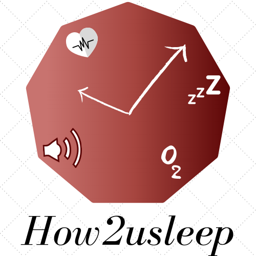

<p align="center">
  <a href="https://andersonalencarbarros.github.io/How2uSleepRepo/" target="_blank">
    <br/>
  </a>
  Click to check it out!
</p>

First at all, install [NodeJs](https://nodejs.org/en) and [Git](https://git-scm.com/)

## Run

Download the repository or use if you have Git installed

``` git clone https://github.com/AndersonAlencarBarros/How2uSleepRepo.git```

Now on the folder, run the following commands:

```npm install```

```npm run build```

```npm start```

## Authors

* Anderson de Alencar
* Djeysi Alves
* Uendel Couto
